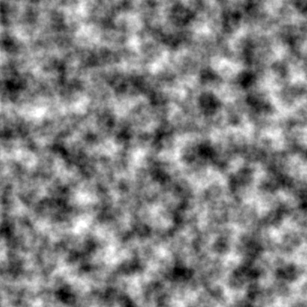

# Perlin Noise

This program renders an image of a given size with Perlin noise applied to it.

You can choose what "octave" of Perlin noise you want in your generation.
The randomness may also be seeded to work with the same image in different ways.

More octave means more detail in the final image (can also be slower).


## How to use this program

After importing the script, follow the next steps.

Step 1 - Create an object :
```python
obj = Noise()
```
Step 2 - Configure the parameters :
```python
obj.set_size((width, height))
obj.set_octave(octave)
obj.set_path(path_to_folder)
```

**Note:** `width`, `height` and `octave` are positive integers. `path_to_folder` is a string.

Here are the default values of those parameters :
- `width`: 100
- `height`: 100
- `octave`: 1
- `path_to_folder`: None

Step 3 - Create the image and apply the noise on it :
```python
obj.create_canvas()
obj.apply_noise()
```

Step 4 - Display and save the generated image :
```python
obj.show_img()
obj.save_img(name)
```

**Note:** `name` is a string.

## Example

Let's try to run the following line of code:

```python
# After importing the script

# Create the object
img = Noise()
# Set the size to 512x512
img.set_size((512, 512))
# Set the number of octave to 5
img.set_octave(5)
# Set the seed used for the random to "1001"
img.set_seed(1001)
# Set the path where to save the image
img.set_path("C:\\Users\\YourName\\Desktop")
# Save the image with the name "test_image"

# Create the image
img.create_canvas()
# Apply the noise on it
img.apply_noise()

img.save_img("test_img")
# Display the image
img.show_img()
```
This creates an image of 512x512 pixels with 5 octaves of Perlin noise. The seed used for the randomness is "1001".
The image will be saved as "test_img.png" in the following directory : `C:/Users/YourName/Desktop/`, then showed.

Here is the output:



## Others

This program also contains some functions to retrieve some information about your image.

- `get_size` : Returns the size of the image (width, height) in pixels
- `get_seed` : Returns the seed of the random used to generate the image (default: None)
- `get_path` : Returns the path to the place where to save the generated image (default: None)
- `get_octave` : Returns the number of octave used to generate the image (a positive integer) (default: 1)

## Credits

Program inspired by this tutorial :
- https://rtouti.github.io/graphics/perlin-noise-algorithm

My website :
- https://gabhas.fr