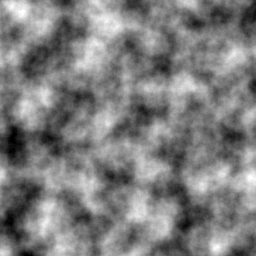

# Perlin Noise

This program renders an image of a given size with Perlin noise applied to it.
You can choose what "octave" of Perlin noise you want in your generation.

More octave means more detail in the final image (can also be slower).


## How to use this program

There are many functions in this program, but the only one you will probably need is : `render_canvas()`.
This function takes the following arguments :
- `width (Integer)` : Canvas width, in pixel (required)
- `height (Interger)` : Canvas height, in pixel (required)
- `preview (Boolean)` : Whether preview the generated image (optional) (default: True)
- `save (Boolean)` : Whether save the generated image (optional) (default: False)
- `path (String)` : The path where the generated image will be saved (optional) (default: "C:")
- `name (String)` : The name of the saved generated image (optional) (default: "noise_XXXXXX")


**Caution:** When entering the path to save an image, make sure of using "/" and not "\\".


**Note:**
The default name of an image is "noise_[NUMBER]" where "[NUMBER]" is a randomly generated number.
The goal of this is to avoid duplicated file name.

## Example

Let's try to run the following line of code:

```python
# After importing the script
render_canvas(256, 256, 10, preview=True, save=True, path="C:/Users/TheRealGabHas/Desktop/")
```
This returns an image of 256x256 pixels with 10 octaves of Perlin noise.
The image will be previewed, then saved in the following directory : `C:/Users/TheRealGabHas/Desktop/`.

Here is the output:



## Credits

Program inspired by this tutorial :
- https://rtouti.github.io/graphics/perlin-noise-algorithm

My website :
- https://gabhas.fr